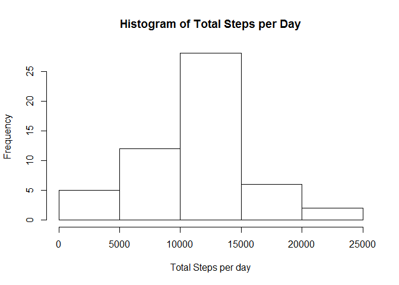
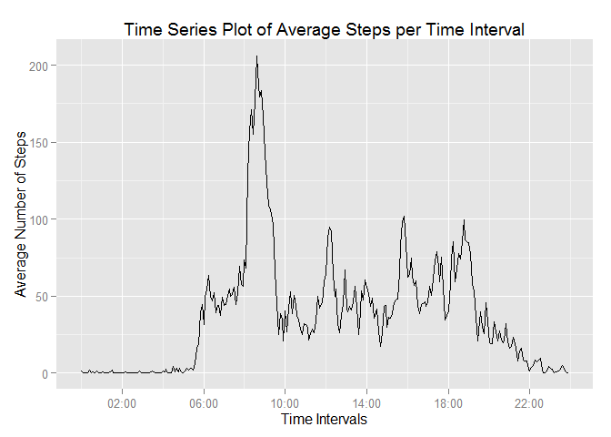
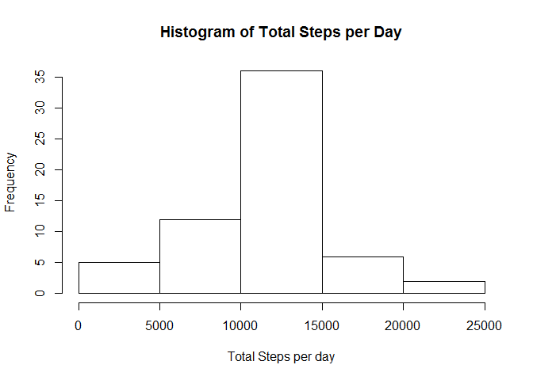
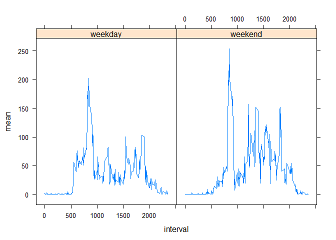

# Reproducible Research: Peer Assessment 1


## Loading and preprocessing the data

```r
library(stringr)
setwd("C:/Users/Justin/Google Drive/Data Science/Reproducible Research/Peer Assignment 1/RepData_PeerAssessment1")
dat<-read.csv(unz("activity.zip",filename="activity.csv"),header=TRUE)
dat$date<-as.Date(dat$date)
```


## What is mean total number of steps taken per day?

```r
totsteps<-aggregate(dat$steps,by=list(dat$date),sum)
names(totsteps)<-c("Date","TotalSteps")
hist(totsteps$TotalSteps,main="Histogram of Total Steps per Day",xlab="Total Steps per day")
```

 

```r
avgsteps<-mean(totsteps$TotalSteps,na.rm=TRUE)
mediansteps<-median(totsteps$TotalSteps,na.rm=TRUE)
```
Mean steps per day is 1.0766189\times 10^{4} and median steps per day is 10765.

## What is the average daily activity pattern?

```r
library(ggplot2)
library(scales)
meanstepsbyint<-tapply(dat$steps,list(dat$interval),mean,na.rm=TRUE)
interval<-str_pad(dat$interval,4,pad="0")
interval<-paste(str_sub(interval,1,2),str_sub(interval,3,4),sep=":")
intervalindt<-strptime(interval,format="%H:%M")
df<-data.frame(unique(intervalindt),meanstepsbyint)
rownames(df)<-1:length(unique(interval))
colnames(df)<-c("TimeIntervals","MeanSteps")
ggplot(data=df,aes(TimeIntervals,MeanSteps))+geom_line()+ scale_x_datetime(labels=date_format("%H:%M"),breaks="4 hours")+xlab("Time Intervals")+ylab("Average Number of Steps")+ggtitle("Time Series Plot of Average Steps per Time Interval")
```

 

```r
maxstepsint<-max(df$MeanSteps,na.rm=TRUE)
maxstepsint<-rownames(meanstepsbyint)[match(maxstepsint,meanstepsbyint)]
```

The 5-minute interval with the maximum number of steps on average is 835.


## Imputing missing values

```r
noNA<-length(complete.cases(dat)[complete.cases(dat)==FALSE])
dat2<-dat
dimdat<-dim(dat2)
for (i in 1:dimdat[1]) {
        if(is.na(dat2$steps[i])) {
                int<-dat2$interval[i]
                temp<-meanstepsbyint[rownames(meanstepsbyint)==int]
                dat2$steps[i]<-temp
        }
}
totsteps2<-aggregate(dat2$steps,by=list(dat2$date),sum)
names(totsteps2)<-c("Date","TotalSteps")
hist(totsteps2$TotalSteps,main="Histogram of Total Steps per Day",xlab="Total Steps per day")
```

 

```r
avgsteps2<-mean(totsteps2$TotalSteps,na.rm=TRUE)
mediansteps2<-median(totsteps2$TotalSteps,na.rm=TRUE)
avgdiff<-avgsteps-avgsteps2
mediandiff<-mediansteps-mediansteps2
```

The number of missing values in the dataset is 2304.
The strategy to impute missing data was to use the average of the matching 5-min interval.
The difference for mean is 0 and median is -1.1886792.
The impacting of imputing data has no impact on mean but has an impact on the median by lowering the median. 


## Are there differences in activity patterns between weekdays and weekends?

```r
library(lubridate)
library(plyr)
```

```
## 
## Attaching package: 'plyr'
## 
## The following object is masked from 'package:lubridate':
## 
##     here
```

```r
library(lattice)
dat2$datetype<-wday(dat$date)
dat2$datetype<-sapply(dat2$datetype,function(x) {if(x<6){x<-"weekday"}else{x<-"weekend"}})
temp<-ddply(dat2,c("interval","datetype"),summarise,mean=mean(steps))
xyplot(mean~interval|datetype,data=temp,type="l")
```

 
